# Task Management App

A collaborative task management system built with FastAPI and MongoDB. Designed for teams, it enables project managers to assign tasks, team leads to delegate and monitor, and team members to update progress.

## UI Sample

Here is a sample of the application's dashboard:


## Project Structure

```
task-management-app
├── app
│   ├── main.py                  # FastAPI application entry point
│   ├── models
│   │   └── task.py              # Task data model definitions & schemas for validation
│   │   └── team.py              # Team and team member data models & validation
│   ├── repositories
│   │   ├── task_repository.py   # Data access logic for tasks
│   │   ├── team_repository.py   # Data access logic for teams
│   │   └── team_member_repository.py # Data access for team members
│   ├── routes
│   │   ├── team_lead.py         # Endpoints for team leads
│   │   ├── team_member.py       # Endpoints for team members
│   │   └── project_manager.py   # Endpoints for project managers
│   └── services
│       ├── task_service.py      # Business logic for tasks
│       ├── team_service.py      # Business logic for teams
│       └── team_member_service.py # Business logic for team members
├── config
│   └── database.py              # MongoDB connection setup
├── requirements.txt             # Python dependencies
├── README.md                    # Project documentation
└── .env                         # Environment variables
```

## Getting Started

### 1. Clone the repository

```bash
git clone <repository-url>
cd task-management-app
```

### 2. Set up a virtual environment

```bash
python -m venv venv
source venv/bin/activate  # On Windows: venv\Scripts\activate
```

### 3. Install dependencies

```bash
pip install -r requirements.txt
```

### 4. Configure MongoDB

Add your MongoDB connection string to the `.env` file:

```
MONGODB_URL=<your_mongodb_connection_string>
```

### 5. Run the application

```bash
uvicorn app.main:app --reload
```

## API Endpoints

### Project Manager

- `POST /project-manager/tasks/` — Create a new task
- `POST /project-manager/assign-task` — Assign a task to a user
- `GET /project-manager/tasks` — View all tasks and progress
- `GET /project-manager/task/{task_id}` — Get a specific task by ID
- `POST /project-manager/team-member` — Create a team member
- `POST /project-manager/add-team-members` — Assign existing members to a team
- `POST /project-manager/remove-team-members` — Remove members from a team
- `GET /project-manager/team-members` — List all team members or by team

### Team Lead

- `POST /team-lead/assign-task` — Assign a task to a team member
- `GET /team-lead/tasks` — View tasks assigned by the team lead
- `PUT /team-lead/update-task/{task_id}` — Update a task
- `GET /team-lead/track-tasks` — Track all team tasks
- `POST /team-lead/create-team` — Create a new team
- `POST /team-lead/add-team-members` — Add members to a team
- `POST /team-lead/team-member` — Create a team member
- `GET /team-lead/team-members` — List all team members
- `GET /team-lead/team-member/{team_member_id}` — Get a team member by ID
- `PUT /team-lead/team-member/{team_member_id}` — Update a team member
- `DELETE /team-lead/team-member/{team_member_id}` — Delete a team member

### Team Member

- `GET /team-member/tasks/` — List assigned tasks
- `PUT /team-member/tasks/{task_id}` — Update task status
- `POST /team-member/team-member` — Create a team member
- `GET /team-member/team-members` — List all team members
- `GET /team-member/team-member/{team_member_id}` — Get a team member by ID

###  Flow diagram
## Architecture Flow Diagram

### Frontend-Backend Integration Flow

``` mermaid
graph TB

    %% Frontend
    subgraph "🌐 React Frontend (Port 3000)"
        A["App.jsx"]
        B["LoginPage 🔐"]
        C["Dashboard 📊"]
        D["API Layer 🛠️"]
        E["Project Manager 👨‍💼"]
        F["Team Lead 👨‍💻"]
        G["Team Member 👩‍💻"]
        H["NavigationHeader 🧭"]
        I["RequireAuth 🔒"]
    end

    %% Frontend Flow
    A --> B
    B --> C
    A --> H
    A --> I
    C --> E
    C --> F
    C --> G
    E --> D
    F --> D
    G --> D

    %% Backend
    subgraph "🚀 FastAPI Backend (Port 8000)"
        K["main.py"]
        L["Auth Dependencies 🔑"]
        M["/project-manager/*"]
        N["/team-lead/*"]
        O["/team-member/*"]
        P["/auth/*"]
        Q["Task Service 📋"]
        R["Team Service 👥"]
        S["Member Service 👤"]
        T["Task Repo 📋"]
        U["Team Repo 👥"]
        V["Member Repo 👤"]
    end

    %% Backend Flow
    D -->|HTTP Req.| K
    K -->|JSON Res.| D
    K --> L
    L --> M
    L --> N
    L --> O
    K --> P
    M --> Q
    M --> R
    M --> S
    N --> Q
    N --> R
    N --> S
    O --> Q
    O --> S
    Q --> T
    R --> U
    S --> V

    %% Database
    subgraph "🍃 MongoDB"
        W["MongoDB 🍃"]
        X["team_tasks_view 📊"]
        Y["tasks collection 📋"]
        Z["teams collection 👥"]
        AA["members collection 👤"]
    end

    %% Data Persistence
    T --> W
    U --> W
    V --> W
    T --> X
    T --> Y
    U --> Z
    V --> AA
```

### Key Integration Points

#### 1. **Authentication Flow**
- **Frontend**: `LoginPage.jsx` → `api.js` → `login()` function
- **Backend**: `POST /auth/login` → JWT token generation
- **Storage**: Token stored in `localStorage` for subsequent requests

#### 2. **Role-Based Access**
- **Frontend**: `RequireAuth` component checks for valid token
- **Backend**: `require_roles()` dependency validates user permissions
- **Routes**: Different page components for each role (PM, TL, TM)

#### 3. **Data Flow Examples**

**Task Management:**
ProjectManagerTasksPage.jsx
↓ (fetchTasks)
api.js → GET /project-manager/tasks
↓
project_manager.py → get_all_tasks()
↓
TaskService.get_all_tasks()
↓
TaskRepository.get_all()
↓
MongoDB team_tasks_view
↓ (JSON response)
React State Update → UI Render

**Team Management:**
ProjectManagerTeamsPage.jsx
↓ (createTeam)
api.js → POST /project-manager/create-team
↓
project_manager.py → create_team()
↓
TeamService.create_team()
↓
TeamRepository.create()
↓
MongoDB teams collection

### 4. **API Communication Pattern**
- **Headers**: All requests include `Authorization: Bearer <token>`
- **Base URL**: `http://localhost:8000` (configurable)
- **Error Handling**: Try-catch blocks with user-friendly error messages
- **Loading States**: Spinner components during API calls

#### 5. **State Management**
- **Local State**: React `useState` for component-level data
- **Token Storage**: `localStorage` for authentication persistence
- **Real-time Updates**: Manual refresh after CRUD operations

## Code Documentation

All modules and methods include up-to-date docstrings describing their purpose, arguments, return values, and exceptions. See the code for details.
## Code Documentation

All modules and methods include up-to-date docstrings describing their purpose, arguments, return values, and exceptions. See the code for details.
